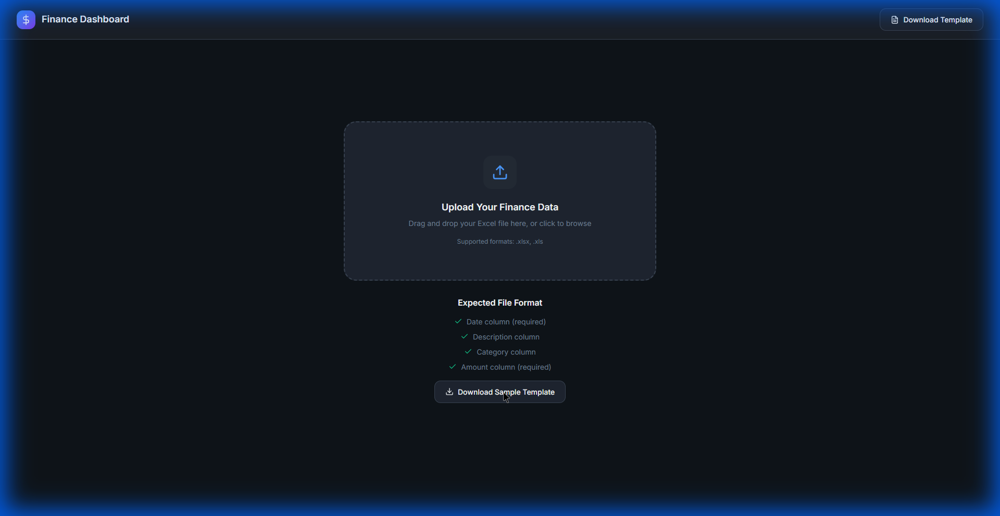
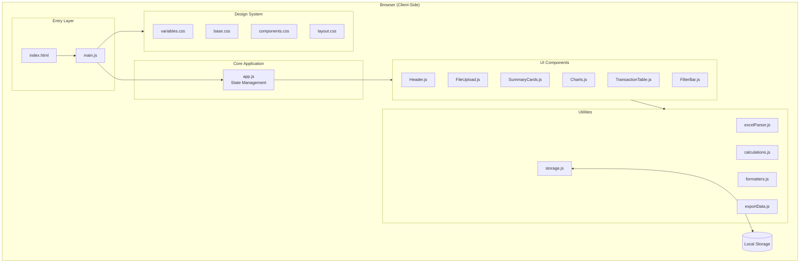
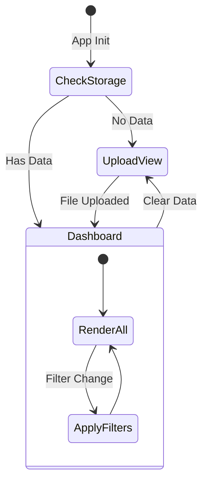
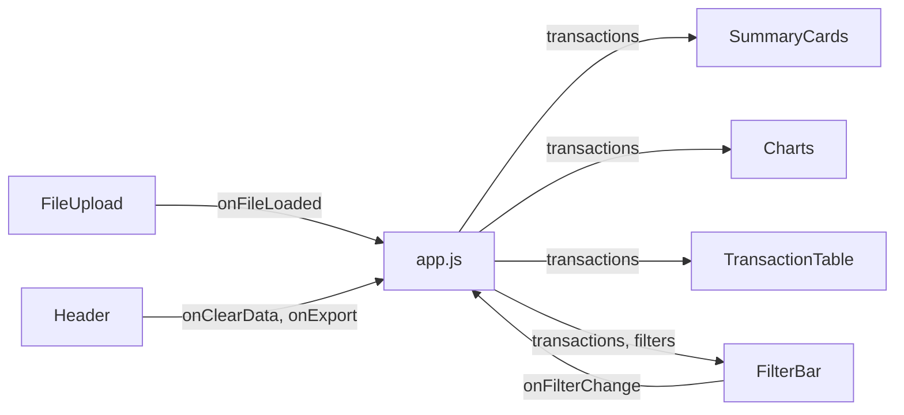
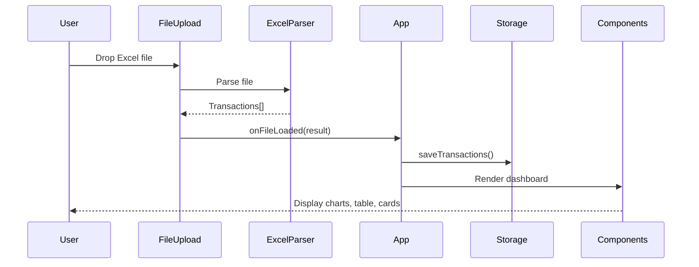

# Zero-Config Personal Finance Dashboard

A professional, privacy-first personal finance dashboard that allows you to upload Excel files and visualize your financial data through interactive charts, summary statistics, and a sortable transaction table.



## Features

- **Excel Template Upload** - Drag-and-drop or click to upload `.xlsx`/`.xls` files
- **Automatic Data Parsing** - Intelligent column detection and data normalization
- **Financial Summary Cards** - Income, expenses, balance, and savings rate at a glance
- **Interactive Charts** - Monthly trends and category breakdown visualizations
- **Transaction Table** - Sortable, filterable, paginated transaction list
- **Export Functionality** - Download reports as Excel files
- **Data Persistence** - Local storage keeps your data between sessions
- **Privacy-First** - All processing happens client-side, no data sent to servers

---

## Architecture Overview



---

## Project Structure

```
tpi_project/
├── index.html              # Main HTML entry point
├── package.json            # Dependencies and scripts
├── vite.config.js          # Vite build configuration
├── test_finance_data.xlsx  # Sample test data
│
└── src/
    ├── main.js             # Application entry point
    ├── app.js              # Core application logic
    │
    ├── components/         # UI Components
    │   ├── Header.js
    │   ├── FileUpload.js
    │   ├── SummaryCards.js
    │   ├── Charts.js
    │   ├── TransactionTable.js
    │   └── FilterBar.js
    │
    ├── utils/              # Utility Functions
    │   ├── excelParser.js
    │   ├── calculations.js
    │   ├── storage.js
    │   ├── formatters.js
    │   └── exportData.js
    │
    └── styles/             # CSS Design System
        ├── variables.css
        ├── base.css
        ├── components.css
        └── layout.css
```

---

## Component Details

### Entry Layer

| File | Purpose |
|------|---------|
| `index.html` | Main HTML structure with semantic containers for dynamic content injection |
| `main.js` | Entry point that imports CSS and initializes the application |

### Core Application

#### `app.js` - State Management & Coordination



**Responsibilities:**
- Manages application state (transactions, filters)
- Coordinates component rendering
- Handles file upload, export, and clear data events
- Applies filters and updates views

---

### UI Components

| Component | File | Functionality |
|-----------|------|---------------|
| **Header** | `Header.js` | Brand logo, title, Download Template / Export / Clear buttons |
| **FileUpload** | `FileUpload.js` | Drag-and-drop zone, file validation, loading states |
| **SummaryCards** | `SummaryCards.js` | 4 cards: Total Income, Total Expenses, Net Balance, Savings Rate |
| **Charts** | `Charts.js` | Monthly bar chart (income vs expenses), Category doughnut chart |
| **TransactionTable** | `TransactionTable.js` | Sortable columns, pagination, amount formatting with colors |
| **FilterBar** | `FilterBar.js` | Search, category filter, type filter, date range, reset |

#### Component Data Flow



---

### Utility Modules

#### `excelParser.js` - Excel File Processing


**Features:**
- Supports `.xlsx`, `.xls`, `.xlsm` formats
- Automatic column detection (Date, Description, Category, Amount, Type)
- Date parsing for multiple formats
- Amount normalization (handles currency symbols, negatives)
- Type inference from amount sign

#### `calculations.js` - Financial Calculations

| Function | Description |
|----------|-------------|
| `calculateTotalIncome()` | Sum of all income transactions |
| `calculateTotalExpenses()` | Sum of all expense transactions |
| `calculateBalance()` | Income minus expenses |
| `calculateSavingsRate()` | Balance / Income ratio |
| `calculateByCategory()` | Group and sum by category |
| `calculateByMonth()` | Group by month with income/expense totals |
| `filterByDateRange()` | Filter transactions by date range |
| `filterByCategory()` | Filter by category name |
| `filterByType()` | Filter by income/expense type |
| `searchTransactions()` | Search in description/category |

#### `storage.js` - Local Storage Persistence

| Function | Description |
|----------|-------------|
| `saveTransactions()` | Save transactions to localStorage |
| `loadTransactions()` | Load and restore Date objects |
| `clearTransactions()` | Remove all stored data |
| `hasStoredData()` | Check if data exists |

#### `formatters.js` - Display Formatting

| Function | Description |
|----------|-------------|
| `formatCurrency()` | Format number as USD currency |
| `formatDate()` | Format date (short/medium/long) |
| `formatNumber()` | Format with thousand separators |
| `formatPercentage()` | Format as percentage |
| `parseDate()` | Parse various date string formats |

#### `exportData.js` - Export Functions

| Function | Description |
|----------|-------------|
| `exportToExcel()` | Export transactions as Excel |
| `exportToCSV()` | Export transactions as CSV |
| `exportSummaryReport()` | Export full report with summary, categories, monthly data |
| `downloadSampleTemplate()` | Generate and download sample template |

---

### Design System

#### `variables.css` - Design Tokens

```css
/* Color Palette */
--color-bg-primary: #0f1419      /* Main background */
--color-surface: #1e2530         /* Card backgrounds */
--color-accent-primary: #4c9aff  /* Primary accent */
--color-income: #10b981          /* Green for income */
--color-expense: #ef4444         /* Red for expenses */

/* Typography */
--font-family: 'Inter', sans-serif
--font-size-base: 1rem

/* Spacing */
--space-4: 1rem
--space-6: 1.5rem

/* Effects */
--radius-xl: 1rem
--shadow-glow: 0 0 20px rgba(76, 154, 255, 0.2)
```

#### CSS Files

| File | Purpose |
|------|---------|
| `variables.css` | CSS custom properties (colors, typography, spacing) |
| `base.css` | Reset, typography, utilities |
| `components.css` | Buttons, cards, tables, forms, upload zone |
| `layout.css` | Page structure, grid layouts, responsive breakpoints |

---

## Data Flow



---

## Getting Started

### Installation

```bash
cd c:\Users\sauca\Desktop\tpi_project
npm install
```

### Development

```bash
npm run dev
```

Opens at http://localhost:3000

### Production Build

```bash
npm run build
npm run preview
```

---

## Excel Template Format

| Column | Required | Description | Example |
|--------|----------|-------------|---------|
| Date | Yes | Transaction date | 2026-01-15 |
| Description | No | Transaction description | Grocery Store |
| Category | No | Category name | Food & Dining |
| Amount | Yes | Transaction amount | 125.50 or -125.50 |
| Type | No | Income or Expense | Expense |

> **Note:** If Type is not provided, it's inferred from the amount sign (positive = Income, negative = Expense)

---

## Technologies

| Technology | Purpose |
|------------|---------|
| Vite | Build tool and dev server |
| SheetJS (xlsx) | Excel file parsing and generation |
| Chart.js | Data visualization |
| Vanilla JavaScript | No framework dependencies |
| CSS Custom Properties | Design system |

---

## License

MIT License - Free for personal and commercial use.
